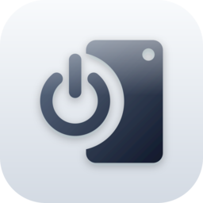
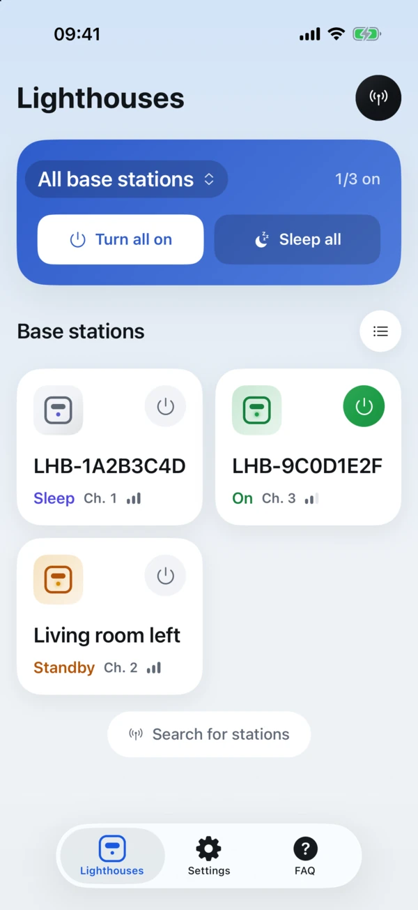
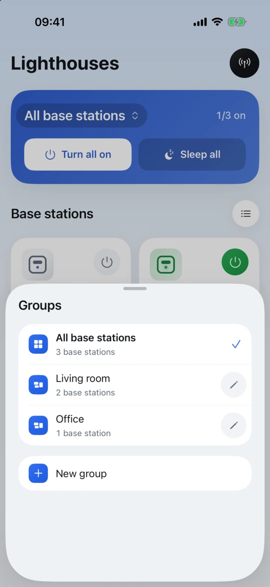
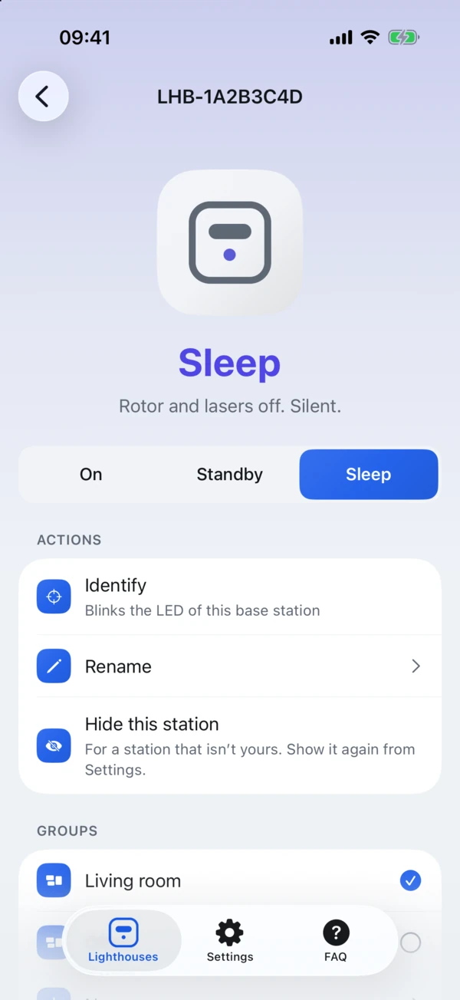
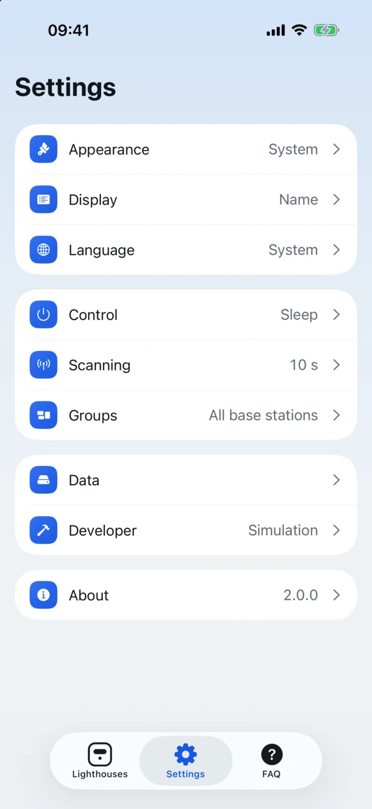

<div align="center">



# Lighthouse Guard

**Wake, sleep and group your SteamVR Base Station 2.0 from your phone.**<br />
No PC, no SteamVR, no cable: just Bluetooth.


[](LICENSE)

</div>

<p align="center">
  <picture>
    <source media="(prefers-color-scheme: dark)" srcset="docs/screenshots/dark/01-home.webp" />
    
  </picture>
  <picture>
    <source media="(prefers-color-scheme: dark)" srcset="docs/screenshots/dark/03-groups.webp" />
    
  </picture>
  <picture>
    <source media="(prefers-color-scheme: dark)" srcset="docs/screenshots/dark/05-detail.webp" />
    
  </picture>
  <picture>
    <source media="(prefers-color-scheme: dark)" srcset="docs/screenshots/dark/07-settings.webp" />
    
  </picture>
</p>

<p align="center"><a href="docs/screenshots/README.md">See every screen, in light and dark →</a></p>

## Contents

- [Why](#why)
- [Features](#features)
- [Compatibility](#compatibility)
- [Getting started](#getting-started)
- [Using the app](#using-the-app)
- [Development](#development)
- [How it works](#how-it-works)
- [Troubleshooting](#troubleshooting)
- [Roadmap](#roadmap)
- [Contributing](#contributing)
- [Acknowledgements](#acknowledgements)
- [License and disclaimer](#license-and-disclaimer)

## Why

SteamVR can put base stations to sleep, but only while it runs on a PC. Anytime else they keep spinning, humming and wearing their motors. Lighthouse Guard talks to them directly over Bluetooth LE. Wake the room before you put the headset on, and send everything to sleep when you're done, from your phone.

## Features

- **Discovery**: finds every Base Station 2.0 in range (`LHB-XXXXXXXX`) and reads its power state.
- **Power control**: one tap to toggle on or sleep. You can also pick **On**, **Standby** (lasers off, rotor spinning, fast wake-up) or **Sleep** (everything off, silent).
- **Groups**: group stations by room or setup ("Living room", "Office"). Switch groups from the main card, then turn a whole group on or off. You can also choose the group shown at launch.
- **Fleet actions**: _Turn all on_ and _Sleep all_ show live progress. Every unit is written first, then all of them are polled in parallel.
- **Identify**: blinks a station's LED so you know which one is which.
- **Rename**: give each station a name you'll recognise. Names stay on the phone.
- **Station details**: RF channel, firmware, model, serial number and manufacturer, read over Bluetooth. A warning appears when two stations share a channel.
- **Personalisation**:
  - list or grid layout, sorted by name, status or signal;
  - light, dark or system theme, seven accent colours, ten app icons (with iOS dark and tinted variants);
  - English or French, whatever the system language;
  - channel and signal on cards, launch animation, haptics.
- **Behaviour**:
  - turn off to Sleep or Standby;
  - confirmation before turning a whole group off;
  - search at launch, search duration, refresh when coming back to the app;
  - hide stations that aren't yours.
- **Backups**: export and import names, groups and settings as a JSON file. Stations are matched by factory name, so a backup also works on a new phone. Reset everything in one tap.
- **Simulated stations**: try every feature without hardware (Settings → Developer).
- **Accessible**: VoiceOver and TalkBack labels, 44 pt touch targets, and Reduce Motion support.
- **Private**: no account, no network access, no analytics, and no location permission on Android 12+. Everything stays on the device.

## Compatibility

| Hardware or OS                                            | Status                                                                 |
| --------------------------------------------------------- | ---------------------------------------------------------------------- |
| SteamVR Base Station 2.0 (Valve Index generation, `LHB-`) | Supported                                                              |
| Base Station 1.0 (original HTC Vive)                      | Not supported: it uses a different protocol                            |
| iOS                                                       | iOS 16.4 or later. Tested on iPhone with iOS 27 and real base stations |
| Android                                                   | Builds from the same code base, but not yet tested on a device         |

## Getting started

### Prerequisites

- **Node 24** (see [`.nvmrc`](.nvmrc)) with Corepack enabled. The repository pins **Yarn 4**.
- **Xcode 27** for iOS, and/or **Android Studio** (SDK 36+) for Android.
- A **physical phone** to control real stations. Simulators have no Bluetooth, but the simulated stations work there.

### Install and run

```bash
git clone git@github.com:Zaphkiel-Ivanovna/lighthouse-guard.git
cd lighthouse-guard
corepack enable
yarn install

yarn ios               # build and launch the dev client on an iOS simulator
yarn ios --device      # or on a connected iPhone
yarn android           # or on an Android device or emulator
```

> [!IMPORTANT]
> The app uses Nitro native modules (Unistyles, MMKV, BLE), so it doesn't run in **Expo Go**. `yarn ios` and `yarn android` build a development client instead.

> [!TIP]
> To install on your own iPhone, set `ios.appleTeamId` in [`app.config.ts`](app.config.ts) to your Apple team ID. A free Personal Team is enough for sideloading.

After the first build, `yarn start` is enough: Metro serves the JavaScript and changes reload instantly.

## Using the app

1. Plug in your base stations and stay within a few metres.
2. Open the app. It scans on launch. Pull to refresh, or tap the antenna button to scan again.
3. Tap the power button on a card for a quick on/sleep toggle. Open a station for Standby, Identify, Rename and its groups.
4. Tap the title of the main card (**All base stations ⌃⌄**) to switch groups or create one. _Turn all on_ and _Sleep all_ then apply to that group only.
5. In **Settings**, pick the theme, the accent colour, the app icon and the group shown at launch.

## Development

| Command                     | What it does                                                           |
| --------------------------- | ---------------------------------------------------------------------- |
| `yarn start`                | Metro for the dev client                                               |
| `yarn ios` / `yarn android` | Build and run the dev client                                           |
| `yarn verify`               | Lint, format check, typecheck and unit tests (run before every commit) |
| `yarn test`                 | Jest with React Native Testing Library                                 |
| `yarn test:e2e`             | [Maestro](https://maestro.dev) flows in [`.maestro/`](.maestro)        |
| `yarn prebuild`             | Regenerate `ios/` and `android/` from `app.config.ts`                  |
| `yarn doctor`               | expo-doctor                                                            |

### Stack

Expo SDK 58 · React Native 0.88 · React 19 with the React Compiler · TypeScript (strict) · expo-router with native tabs · [Unistyles 3](https://www.unistyl.es) · zustand and MMKV · [react-native-ble-nitro](https://github.com/zykeco/react-native-ble-nitro) · Reanimated 4 · i18next.

### Project structure

```text
src/
├── app/        routes only (expo-router), thin re-exports of feature screens
├── features/   vertical slices: lighthouses (and groups), settings, faq
├── shared/     design system (ui/), navigation options, utilities
├── theme/      design tokens, light and dark themes, accent colours
└── core/       BLE stack, app icon, storage, i18n, logger
```

Dependencies flow one way: `app → features → shared → theme → core`. ESLint and the repository hooks enforce it. [`docs/architecture.md`](docs/architecture.md) has the full map and data flow.

### App icons

The icons are generated from the master logo ([`assets/brand/logo.svg`](assets/brand/logo.svg)). To regenerate every variant (iOS light, dark and tinted, Android adaptive layers, thumbnails), run:

```bash
python3 scripts/brand/generate_icons.py   # needs rsvg-convert and ImageMagick
```

## How it works

Base Station 2.0 exposes a small GATT service. The app scans for the `LHB-` name prefix, then opens short sessions to read or write a single byte.

| Characteristic | UUID                                   | Values                                                          |
| -------------- | -------------------------------------- | --------------------------------------------------------------- |
| Power          | `00001525-1212-efde-1523-785feabcd124` | write `0x00` sleep, `0x01` on, `0x02` standby · read state byte |
| Identify       | `00008421-1212-efde-1523-785feabcd124` | write `0x00` to blink the LED                                   |

The power state read back includes the values used when SteamVR wakes a station (`0x09`, `0x0b`). [`docs/ble-protocol.md`](docs/ble-protocol.md) has the full table and sources.

A base station accepts **one Bluetooth connection at a time**. That's why every operation goes through a serial queue, has a timeout, and always disconnects when done. It keeps the stations visible to SteamVR and to other phones. The BLE layer sits behind a transport interface, with a mock implementation that powers the simulated stations, the unit tests and the end-to-end flows.

## Troubleshooting

<details>
<summary><strong>A base station doesn't show up</strong></summary>

- Make sure it's plugged in and within a few metres, then scan again.
- Check the Bluetooth permission: iOS Settings → Privacy & Security → Bluetooth, or "Nearby devices" on Android.
- Power-cycle the station: unplug it, wait until it's fully off, plug it back in, then scan once it has restarted.

</details>

<details>
<summary><strong>A command fails or times out</strong></summary>

A station only accepts one Bluetooth connection at a time. Close any other app that manages base stations, and SteamVR's base station power management, then retry.

</details>

<details>
<summary><strong>The development build closes when the JavaScript reloads</strong></summary>

This is a known issue of the Expo SDK 58 preview (`ExpoFabricView.injectInitializer`) and only affects development builds. Relaunch the app.

</details>

## Roadmap

- [x] Scan, power modes, identify, rename
- [x] Groups, fleet actions, group shown at launch
- [x] Themes, accent colours and alternate app icons
- [x] Station details, channel conflicts, preferences, backups
- [ ] Home Screen widgets
- [ ] Siri, Shortcuts and App Intents
- [ ] Background automations (sleep the room at a set time)
- [ ] Android testing on real hardware

## Contributing

Issues and pull requests are welcome. Before opening a PR:

1. Run `yarn verify`. It must pass.
2. Follow the conventions in [`CLAUDE.md`](CLAUDE.md) and [`.claude/rules/`](.claude/rules):
   - Yarn only;
   - Unistyles for styling;
   - every UI string in both `en.ts` and `fr.ts`;
   - no comments in code.
3. Ship new behaviour with tests. BLE logic is tested against the mock transport, never against real hardware.

The repository is set up for AI-assisted development with [Claude Code](https://claude.com/claude-code):

- **Rules:** path-scoped rules in `.claude/rules/`.
- **Hooks:** guard rails and automatic verification in `.claude/hooks/`.
- **Skills and agents:** scaffolding skills, plus BLE and React Native reviewers.
- **MCP servers:** declared in `.mcp.json`. For the GitHub MCP, export `GITHUB_PERSONAL_ACCESS_TOKEN` first (for example `$(gh auth token)`).

## Acknowledgements

- [BenWoodford's reverse-engineered GATT notes](https://gist.github.com/BenWoodford/3a1e500a4ea2673525f5adb4120fd47c) for the Base Station 2.0 protocol.
- [svrbsctl](https://github.com/chenxiaolong/svrbsctl) and [lighthouse_pm](https://github.com/jeroen1602/lighthouse_pm) for the power state mapping.
- [Expo](https://expo.dev), [Unistyles](https://www.unistyl.es), [react-native-ble-nitro](https://github.com/zykeco/react-native-ble-nitro) and [expo-alternate-app-icons](https://github.com/pchalupa/expo-alternate-app-icons).

## License and disclaimer

Copyright © 2026 Zaphkiel.

Lighthouse Guard is free software. You can redistribute it and/or modify it under the terms of the [GNU General Public License](LICENSE), either version 3 of the License or (at your option) any later version. Any modified version you distribute must also be released under the GPL, with its source code.

Lighthouse Guard is an independent project. It is not affiliated with or endorsed by Valve Corporation or HTC. SteamVR and Valve Index are trademarks of Valve Corporation. The software is provided as is, without warranty of any kind.
