# Screenshots

Captured on an iPhone 17 Pro simulator with the simulated base stations (Settings → Developer). Each screen is shown in light and dark mode.

| Screen                                                                                              | Light                                                                                | Dark                                                                               |
| --------------------------------------------------------------------------------------------------- | ------------------------------------------------------------------------------------ | ---------------------------------------------------------------------------------- |
| **Base stations** Fleet card with the group switcher, grid layout with state, channel and signal |         | 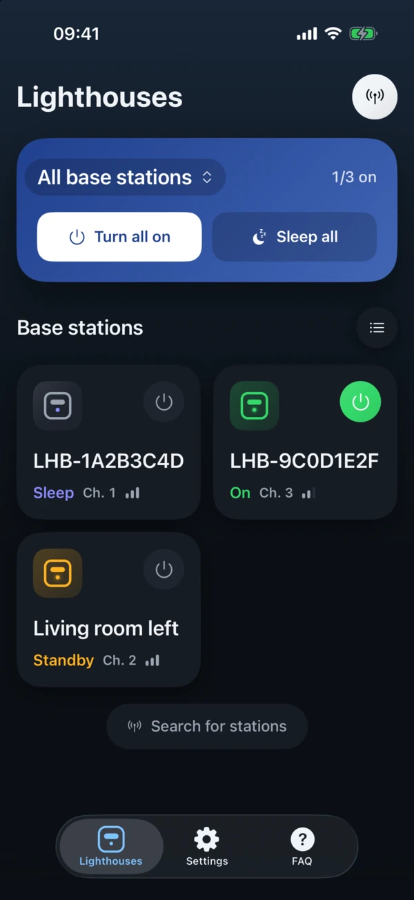        |
| **List layout** Same stations as a list, custom names above factory names                        | 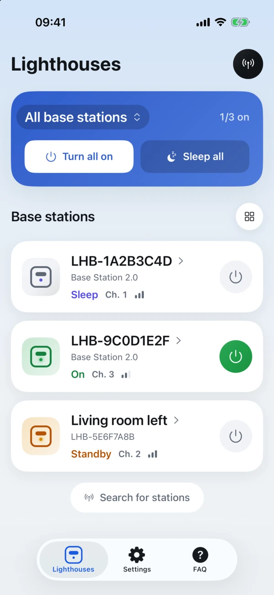   | 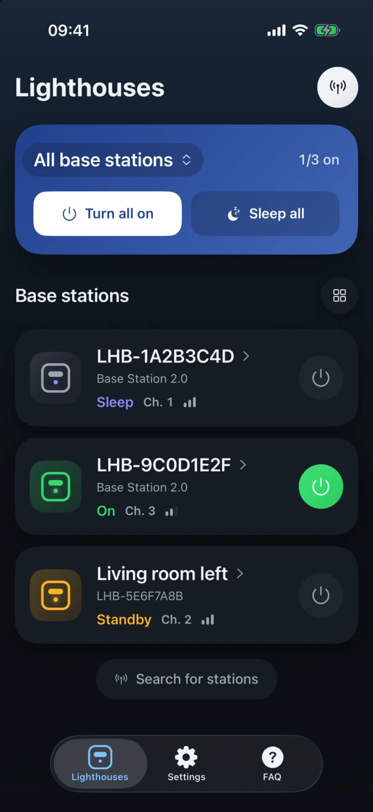   |
| **Groups** Switch between all stations and your groups                                           |              | 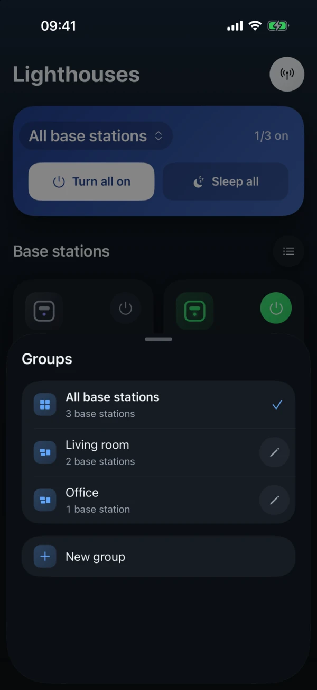             |
| **Group editor** Name a group and pick its stations                                              | 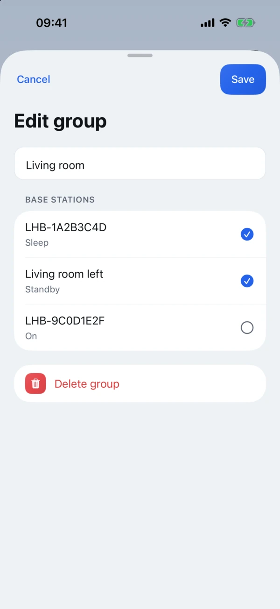       | 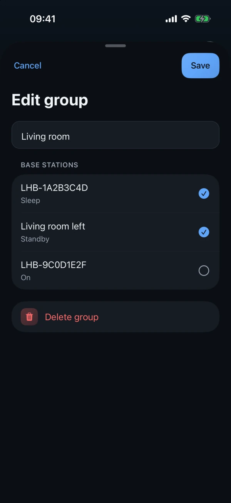       |
| **Station** Power modes, identify, rename, hide                                                  |            | 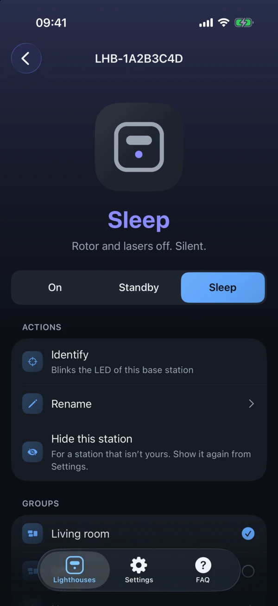           |
| **Station information** Groups, channel, firmware, model, serial number, signal                  | 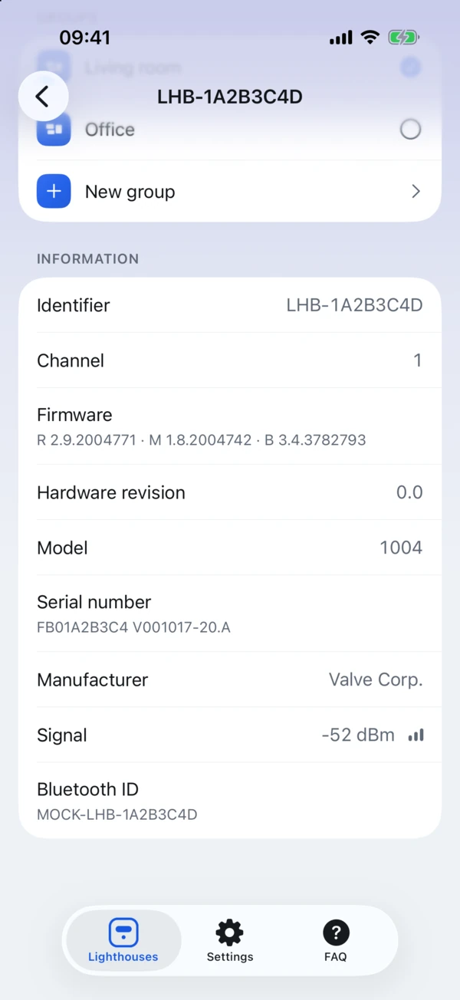 | 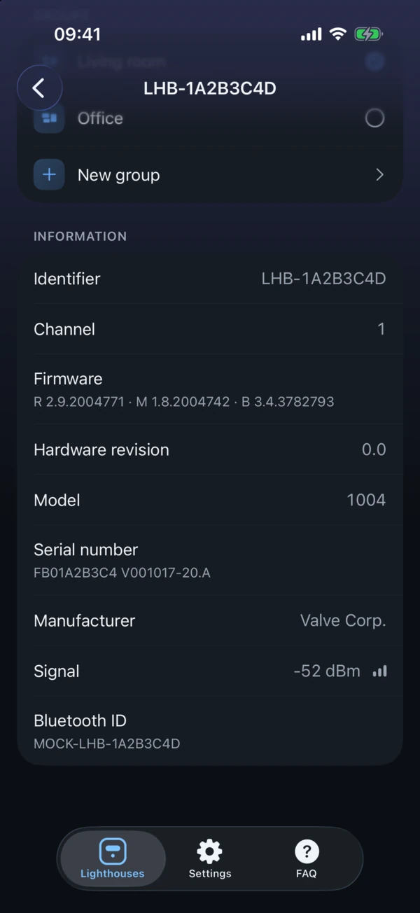 |
| **Settings** iOS-style categories with their current value                                       |                | 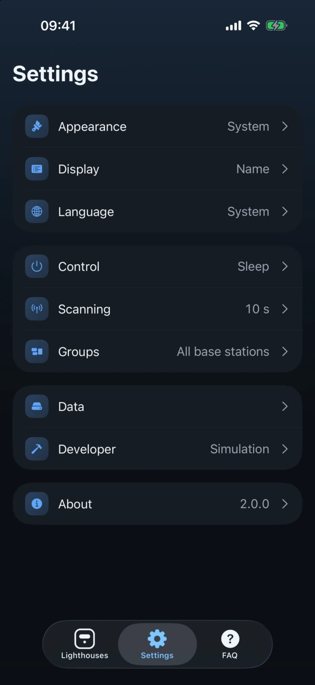               |
| **Appearance** Theme, accent colour, app icon, launch animation                                  | 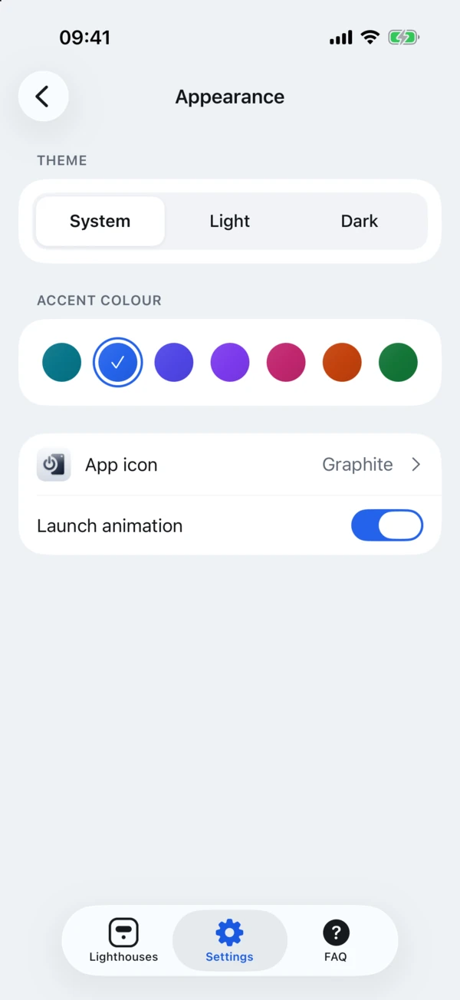  | 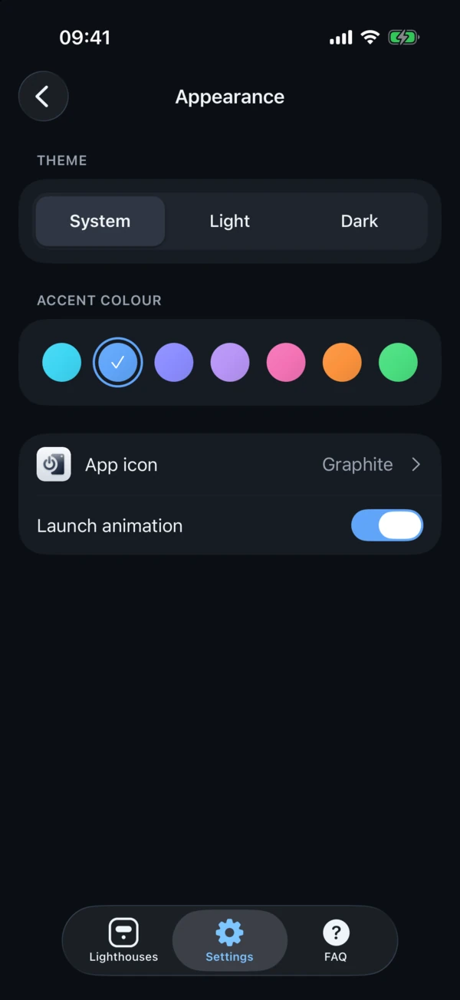  |
| **App icon** Ten icons, Graphite by default                                                      | 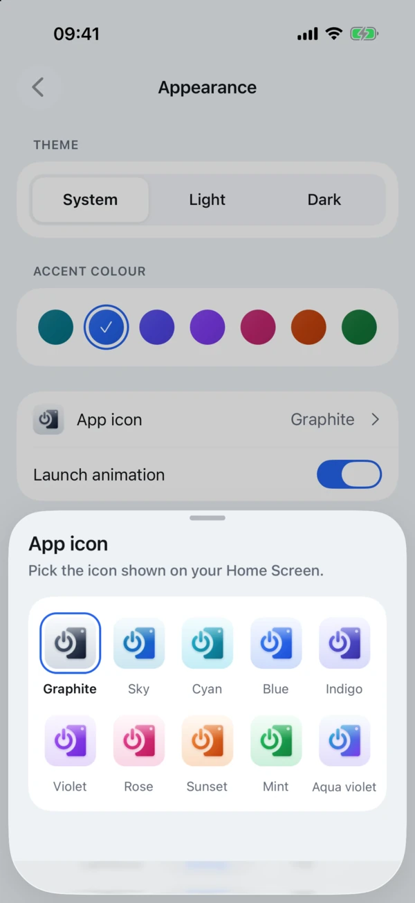        | 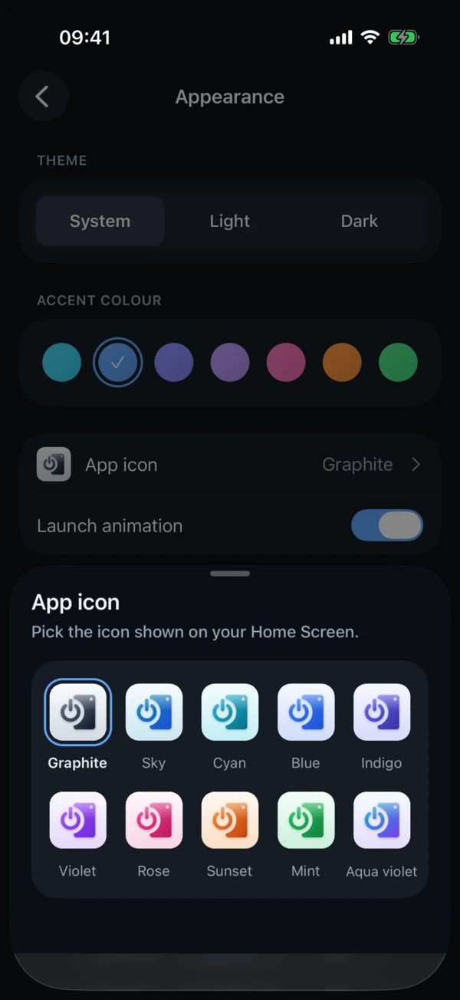        |
| **FAQ** Common questions about base stations                                                     | 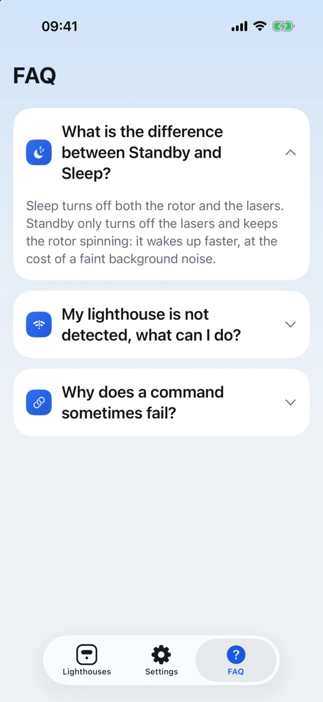                         | 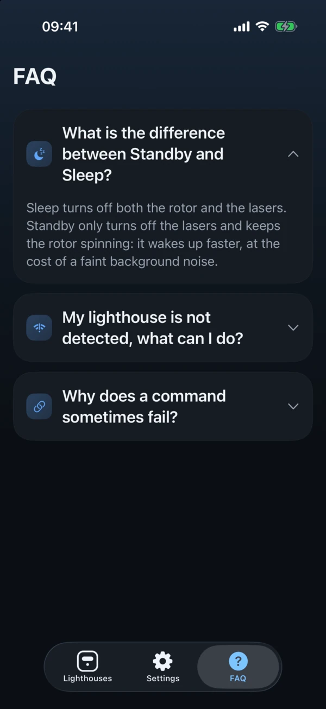                         |
